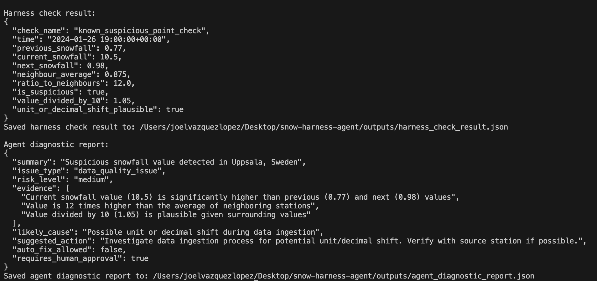
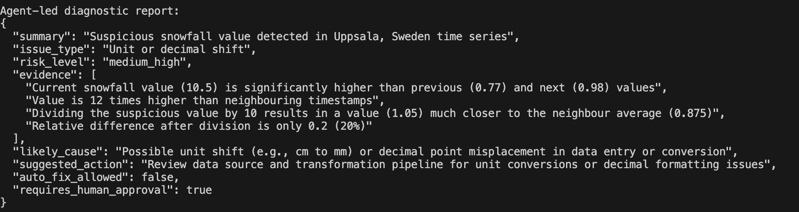

# Snow Harness Agent

A small prototype demonstrating how an agent-harness can be used for time-series-focused, mission-critical data pipelines.

The project uses real historical weather data from Open-Meteo for Uppsala, Sweden. A controlled snowfall anomaly is injected into the time series, and two investigation modes are demonstrated:

1. **Harness-first mode**, where the harness detects the suspicious point first and then asks the agent to explain it.
2. **Agent-led mode**, where the agent chooses which safe diagnostic tools to request, while the harness controls execution and logs the full trace.

The prototype is intentionally small, but it demonstrates the core safety pattern: the agent can investigate and explain, but it cannot modify data, overwrite values, deploy code, or automatically correct anything.

---

## Why this matters

In mission-critical time-series pipelines, especially in domains such as energy forecasting, incorrect data can propagate into downstream forecasts, operational decisions, customer-facing outputs, or automated workflows.

A general-purpose agent is not safe enough on its own. It needs a harness around it.

The harness provides:

* a bounded investigation task;
* approved diagnostic tools;
* controlled tool execution;
* structured outputs;
* trace logging;
* human-approval gates;
* prevention of unsafe automatic fixes.

The broader idea is that agents can be useful in operational data systems, but only when they are constrained by deterministic checks, safe tools, trace logging, and human-review boundaries.

---

## Demo scenario

The demo fetches hourly weather data for Uppsala, Sweden, for January 2024.

The original data contains realistic snowfall values. The prototype then creates a controlled data-quality issue by multiplying the largest real snowfall value by 10.

Example:

```text
Original snowfall: 1.05
Corrupted snowfall: 10.5
```

This simulates a possible unit conversion, decimal point, or parsing error.

The hidden corruption record is saved only for evaluation. The agent does not receive the original value.

---

## Architecture

```text
Real weather data
        |
        v
Controlled anomaly injection
        |
        v
Harness-controlled investigation
        |
        +-----------------------------+
        |                             |
        v                             v
Harness-first mode              Agent-led mode
        |                             |
        v                             v
Harness detects issue           Agent requests safe tools
        |                             |
        v                             v
Agent writes report             Harness executes tools
        |                             |
        v                             v
Harness blocks auto-fix         Agent writes report
        |                             |
        v                             v
Human approval required         Human approval required
```

---

## Version A: Harness-first mode

In the harness-first version, the harness checks the suspicious point first.

The harness compares the corrupted snowfall value with neighbouring timestamps:

```text
Previous snowfall: 0.77
Current snowfall: 10.5
Next snowfall: 0.98
Neighbour average: 0.875
Ratio to neighbours: 12.0
```

The harness then checks whether dividing the suspicious value by 10 produces a plausible value:

```text
10.5 / 10 = 1.05
```

Since `1.05` is close to the neighbouring snowfall values, the harness flags a possible unit or decimal shift.

The agent receives this bounded evidence and writes a diagnostic report.

---

## Version B: Agent-led mode

In the agent-led version, the agent is more active.

The agent receives the issue description and a list of approved tools. It decides which tool to request.

The harness then decides whether the requested tool is allowed. If it is allowed, the harness executes it and returns the result to the agent.

Approved tools in the prototype:

```text
inspect_snowfall_context
check_unit_shift
```

The important difference is that the agent does not directly execute code. It only requests actions. The harness controls what actually runs.

---

## Results

The prototype produces structured diagnostic reports for both investigation modes.

---

### Harness-first diagnostic report

In the harness-first version, the harness first detects the suspicious snowfall value and passes bounded evidence to the agent. The agent then produces a diagnostic report.

```json
{
  "summary": "Suspicious snowfall value detected in Uppsala, Sweden",
  "issue_type": "data_quality_issue",
  "risk_level": "medium",
  "evidence": [
    "Current snowfall value (10.5) is significantly higher than previous (0.77) and next (0.98) values",
    "Value is 12 times higher than the average of neighboring stations",
    "Value divided by 10 (1.05) is plausible given surrounding values"
  ],
  "likely_cause": "Possible unit or decimal shift during data ingestion",
  "suggested_action": "Investigate data ingestion process for potential unit or decimal shift. Verify with source station if possible.",
  "auto_fix_allowed": false,
  "requires_human_approval": true
}
```

This report correctly identifies the suspicious value and blocks automatic correction. One minor limitation is visible here: the agent describes the neighbouring values as “neighboring stations”, although they are actually neighbouring timestamps in the same time series. This motivated a stricter prompt in the agent-led version.



---

### Agent-led diagnostic report

In the agent-led version, the agent requests diagnostic tools, the harness executes only approved tools, and the final report is produced after the tool results are returned.

```json
{
  "summary": "Suspicious snowfall value detected in Uppsala, Sweden time series",
  "issue_type": "Unit or decimal shift",
  "risk_level": "medium_high",
  "evidence": [
    "Current snowfall value (10.5) is significantly higher than previous (0.77) and next (0.98) values",
    "Value is 12 times higher than neighbouring timestamps",
    "Dividing the suspicious value by 10 results in a value (1.05) much closer to the neighbour average (0.875)"
  ],
  "likely_cause": "Possible unit conversion error or decimal point misplacement in data entry",
  "suggested_action": "Verify the data source and correction method with meteorological experts",
  "auto_fix_allowed": false,
  "requires_human_approval": true
}
```

The agent-led report is more precise because the tool result explicitly tells the model that the previous and next values are neighbouring timestamps, not neighbouring stations.



---

### Agent-led trace

The agent-led trace is the most important output of the prototype. It shows that the agent is not directly executing arbitrary actions. Instead, the agent requests tools, the harness executes only approved tools, and every step is logged.

```json
[
  {
    "step": 1,
    "agent_action": {
      "action": "call_tool",
      "tool_name": "inspect_snowfall_context",
      "tool_args": {
        "location": "Uppsala, Sweden",
        "timestamp": "2023-11-15T12:00:00Z"
      }
    }
  },
  {
    "step": 1,
    "harness_executed_tool": "inspect_snowfall_context",
    "tool_result": {
      "tool_name": "inspect_snowfall_context",
      "time": "2024-01-26 19:00:00+00:00",
      "row_index": 619,
      "previous_snowfall": 0.77,
      "current_snowfall": 10.5,
      "next_snowfall": 0.98,
      "neighbour_average": 0.875,
      "ratio_to_neighbouring_timestamps": 12.0,
      "is_suspicious": true,
      "note": "Previous and next values are neighbouring timestamps in the same time series, not neighbouring weather stations."
    }
  },
  {
    "step": 2,
    "agent_action": {
      "action": "call_tool",
      "tool_name": "check_unit_shift",
      "tool_args": {
        "location": "Uppsala, Sweden",
        "timestamp": "2023-11-15T12:00:00Z"
      }
    }
  },
  {
    "step": 2,
    "harness_executed_tool": "check_unit_shift",
    "tool_result": {
      "tool_name": "check_unit_shift",
      "suspicious_value": 10.5,
      "value_divided_by_10": 1.05,
      "neighbour_average": 0.875,
      "relative_difference_after_dividing_by_10": 0.20000000000000004,
      "unit_or_decimal_shift_plausible": true
    }
  },
  {
    "step": 3,
    "agent_action": {
      "action": "final_report",
      "report": {
        "summary": "Suspicious snowfall value detected in Uppsala, Sweden time series",
        "issue_type": "Unit or decimal shift",
        "risk_level": "medium_high",
        "evidence": [
          "Current snowfall value (10.5) is significantly higher than previous (0.77) and next (0.98) values",
          "Value is 12 times higher than neighbouring timestamps",
          "Dividing the suspicious value by 10 results in a value (1.05) much closer to the neighbour average (0.875)"
        ],
        "likely_cause": "Possible unit conversion error or decimal point misplacement in data entry",
        "suggested_action": "Verify the data source and correction method with meteorological experts",
        "auto_fix_allowed": false,
        "requires_human_approval": true
      }
    }
  }
]
```

The trace demonstrates the central safety property of the harness. Even when the agent includes extra tool arguments, the harness does not give the model arbitrary execution power. The harness executes only the approved tool logic on the controlled dataframe and logs the result.

---

## Safety properties demonstrated

This prototype demonstrates several safety properties that are important for mission-critical agent systems:

```text
The agent is read-only.
The agent cannot directly modify the dataset.
The agent cannot deploy code.
The agent cannot automatically correct values.
The harness exposes only approved diagnostic tools.
The harness controls tool execution.
The harness logs each agent action and tool result.
The final report requires human approval before correction.
```

---

## Limitations

This is a deliberately small prototype.

The current demo focuses on one controlled snowfall anomaly and two diagnostic tools. The anomaly is injected intentionally so that the behaviour of the agent-harness loop can be evaluated.

In a production system, the harness would expose a broader toolbox, such as:

```text
check_missing_timestamps
check_duplicate_timestamps
check_schema_drift
check_null_rate
detect_spikes
detect_flatlines
check_staleness
check_timezone_consistency
check_forecast_revision_consistency
compare_with_previous_pipeline_run
compare_with_raw_provider_response
```

The purpose of this prototype is not to solve every possible time-series failure mode. The goal is to demonstrate the control pattern: agent flexibility inside a harness-controlled safety boundary.

---

## How this would generalise

In a real pipeline, the harness would not know the issue in advance. Instead, it would start with a broader investigation task:

```text
Investigate whether this new time-series batch is safe to use downstream.
```

The agent would receive dataset metadata, allowed tools, and a bounded task. It could then request checks such as missing timestamp detection, duplicate detection, schema validation, spike detection, staleness detection, or forecast revision consistency checks.

The harness would execute only approved tools, log every step, and prevent unsafe actions.

A production flow could look like this:

```text
New time-series batch arrives
        |
        v
Harness creates investigation task
        |
        v
Agent requests approved diagnostic tools
        |
        v
Harness executes tools and logs trace
        |
        v
Agent writes diagnostic report
        |
        v
Harness verifies report
        |
        +------------------------------+
        |                              |
        v                              v
Batch allowed downstream        Batch quarantined / human review
```

---

## How to run

Install dependencies:

```bash
pip install -r requirements.txt
```

Create a `.env` file:

```bash
OPENAI_API_KEY=your_key_here
OPENAI_BASE_URL=your_base_url_here
OPENAI_MODEL=your_model_here
```

Run the harness-first version:

```bash
python src/run_demo.py
```

Run the agent-led version:

```bash
python src/run_agent_led_demo.py
```

Outputs are saved in:

```text
outputs/
```

Generated data files are saved in:

```text
data/
```

---

## Repository structure

```text
snow-harness-agent/
├── assets/
│   ├── harness_first_report.png
│   ├── agent_led_report.png
│   └── agent_led_trace.png
├── data/
│   ├── open_meteo_uppsala_clean_original.csv
│   └── open_meteo_uppsala_corrupted.csv
├── outputs/
│   ├── corruption_record_hidden_from_agent.json
│   ├── harness_check_result.json
│   ├── agent_diagnostic_report.json
│   ├── agent_led_diagnostic_report.json
│   └── agent_led_trace.json
├── src/
│   ├── run_demo.py
│   └── run_agent_led_demo.py
├── .env.example
├── .gitignore
├── requirements.txt
└── README.md
```

Note: `data/`, `outputs/`, and `.env` should usually not be committed. The repository can include screenshots or selected example outputs in `assets/`.

---

## Environment variables

The project expects the following variables:

```bash
OPENAI_API_KEY=your_key_here
OPENAI_BASE_URL=your_base_url_here
OPENAI_MODEL=your_model_here
```

An example file can be provided as `.env.example`, but the real `.env` file should not be committed.

---

## Summary

This project is a proof of concept for agent-harness design in time-series data pipelines.

It shows two approaches:

```text
Harness-first:
The harness detects the issue, then the agent explains it.

Agent-led:
The agent chooses diagnostic tools, but the harness controls execution.
```

The prototype demonstrates that agentic systems can be made safer by placing them inside a harness that defines allowed tools, validates structured outputs, logs the trace, and requires human approval before any correction.
